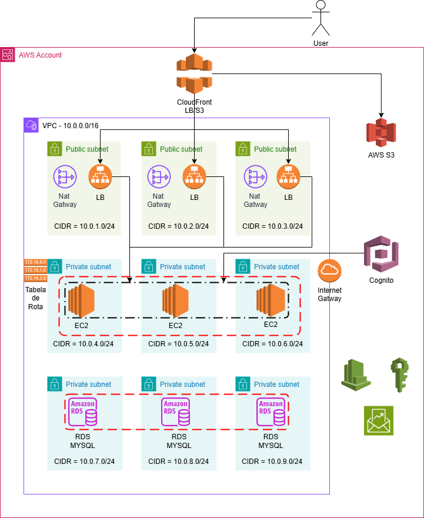

# E-commerce de Produtos Digitais com Terraform

## Visão Geral
Este projeto configura um ambiente de e-commerce para a venda de produtos digitais, como e-books e cursos online, na AWS. Utilizando Terraform, a infraestrutura foi projetada para escalar automaticamente em picos de demanda e inclui medidas de segurança, monitoramento e gerenciamento de custos.

## Arquitetura do Projeto



### Componentes Principais

1. **Front-end**
   - **Amazon S3**: Utilizado para armazenar arquivos estáticos do site.
   - **Amazon CloudFront**: Configurado para entrega de conteúdo e CDN, garantindo alta disponibilidade e baixa latência.

2. **Back-end**
   - **Amazon EC2**: Instâncias configuradas para hospedar a API responsável pelo processamento de pedidos e logins de usuários.
   - **Auto Scaling**: Configurado para ajustar automaticamente a quantidade de instâncias conforme a demanda.

3. **Banco de Dados**
   - **Amazon RDS (MySQL)**: Banco de dados relacional em uma única AZ com backups automáticos diários para garantir a integridade dos dados.

4. **Armazenamento de Produtos**
   - **Amazon S3**: Armazena os arquivos digitais dos produtos, como e-books e cursos.

5. **Segurança**
   - **AWS IAM**: Gerencia permissões e garante que apenas administradores possam acessar o back-end.
   - **Amazon Cognito**: Implementação de autenticação para usuários do front-end.

6. **Monitoramento**
   - **Amazon CloudWatch**: Monitora o desempenho das instâncias EC2 e gera alarmes para o time técnico.

7. **Gerenciamento de Custos**
   - **AWS Budgets**: Configurado para alertar quando os custos mensais ultrapassam um limite predefinido.

## Estrutura do Projeto
A estrutura do projeto em Terraform foi dividida em arquivos módulos para facilitar a manutenção:

- **`cloudfront.tf`**: Configuração do Amazon CloudFront para a entrega de conteúdo.
- **`ec2.tf`**: Definição das instâncias EC2 e configuração de auto scaling.
- **`eip.tf`**: Criação de Elastic IPs para as instâncias.
- **`gateway.tf`**: Configuração do Internet Gateway.
- **`lb.tf`**: Configuração do Load Balancer para distribuir o tráfego entre as instâncias.
- **`locals.tf`**: Declaração de variáveis locais e expressões reutilizáveis.
- **`main.tf`**: Contém a definição principal dos recursos.
- **`provider.tf`**: Configura o provedor AWS.
- **`rds.tf`**: Configuração do Amazon RDS (MySQL).
- **`route.tf`**: Definição das rotas de rede.
- **`s3.tf`**: Configuração dos buckets S3 para armazenamento de arquivos.
- **`securitygroups.tf`**: Definição dos grupos de segurança para controle de acesso.
- **`variable.tf`**: Declaração das variáveis utilizadas para personalização de parâmetros.
- **`vpc.tf`**: Configuração da VPC e sub-redes.

## Como Utilizar

1. Clone este repositório.
2. Configure suas credenciais AWS no ambiente.
3. Inicialize o Terraform:
   ```bash
   terraform init
   ```
4. Verifique o plano de execução:
   ```bash
   terraform plan
   ```
5. Aplique as configurações:
   ```bash
   terraform apply
   ```

## Requisitos

- Terraform v1.5+
- Provedor AWS configurado

## Contribuições
Contribuições são bem-vindas! Por favor, abra um *pull request* ou relate problemas na seção de *issues*.

## Licença
Este projeto está licenciado sob a Licença MIT. Consulte o arquivo [LICENSE](./LICENSE) para mais detalhes.